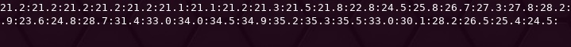
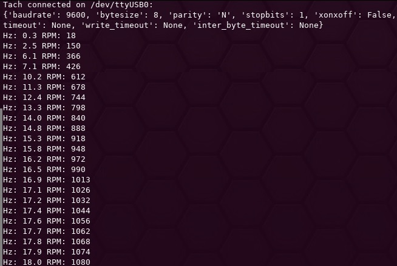
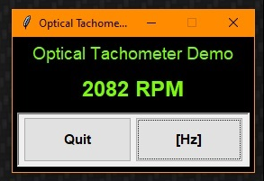

# Optical Tachometer
`optical_tachometer` is a C/C++ source/header pair which can be used in conjunction with
an AVR microcontroller and the
[`optical_tachometer_hardware`](https://github.com/jaylamb/optical_tachometer_hardware)
sensor printed circuit board.

## Usage
This software can be used with the
[`optical_tachometer_hardware`](https://github.com/jaylamb/optical_tachometer_hardware)
sensor to detect the rotational velocity of an object placed in front of the sensor.
The sensor's interface to the microcontroller is a single GPIO pin.

This software provides two primary utilities:
- Calculation of rotational speed (in Hertz) detected by the sensor
- Wait for detection of reflective material in proximity to the sensor

## Test Programs: Microcontroller Peripheral/Resource Utilization
This project includes test programs written to use an ATmega328P microcontroller.
The software has been tested on the [Adafruit Metro Mini
328](https://www.adafruit.com/product/2590).

### General Purpose Input/Output
The software indicates the detection of an object by triggering an external interrupt,
assigned to pin PD2.
The [Adafruit Metro Mini 328](https://www.adafruit.com/product/2590) includes a
[USB-to-UART Bridge](https://www.silabs.com/documents/public/data-sheets/cp2104.pdf),
which makes a serial port available via the USB port.
Serial data is transmitted from the microcontroller on pin PD1, and received by the
microcontroller on pin PD0.

### Interrupts
The following microcontroller interrupts are used by this software:
- External interrupt `INT0` is triggered upon the detection of a rising edge on pin PD2.
- Timer/Counter0 and its overflow interrupt `TIMER0_OVF0` are used to keep track of time
  for frequency calculations.

### Universal Synchronous and Asynchronous serial Receiver and Transmitter
In addition to the previously listed items, this project's test program uses the
microcontroller's Universal Synchronous and Asynchronous serial Receiver and Transmitter
(USART0) to transmit serial data.
The output data is parsed and/or displayed by all of the test programs.

## Test Programs

### Building and Deploying the Test Software
To build and deploy the test software to the microcontroller:

1. Create and navigate to a build directory:

    `cd build && mkdir build/`

2. Point CMake to the AVR toolchain file:

    `cmake -DCMAKE_TOOLCHAIN_FILE=../cmake_avr_functions.cmake ..`

3. Make and deploy the executable:

    `make upload_optical_tachometer`

### Viewing test Output
1. View the output of the C++ test program by opening a serial terminal on the port
connected to the microcontroller following programming.
The UART is configured to use a buad rate of 9600, 8N1 by default.
The output of this program is a velocity measurement in Hertz, which includes a whole
component and a tenths component.
The stream of measurements is delineated with semicolons (:).
A new measurement is transmitted every 0.25 seconds.

2. Run the Python test program from the command line by navigating to the [Python
tests](./test/python_test_program/) and invoking running the `serialtach.py` script:

    `python3 serialtach.py` (Linux) or `py serialtach.py` (Windows)

The output of this program is a velocity measurement in Hertz _and_ revolutions per minute
(RPM), output on a new line.
Upon starting up, the program will indicate which serial port it is using and will provide
a complete list of the serial port's settings.
As with the C++ test program, a new reading is transmitted every 0.25 seconds.

3. Run the Python GUI test program from the command line by navigating to the [Python
tests](./test/python_test_program/) and invoking running the `serialtachgui.py` script:

    `python3 serialtachgui.py` (Linux) or `py serialtachgui.py` (Windows)

When the program starts, a connection via the UART will be made automatically, and
velocity data will refresh in the window as it is received.
the `[Hz]/[RPM]` button can be used to toggle between units.

_Note: By default, the Python test programs are configured to use port `dev/ttyUSB0`._
_The port is set_
[here](https://github.com/jaylamb/optical_tachometer/blob/c85310b8fd87c4a67cde8b0a766c17109863f34e/test/python_test_program/serialtach.py#L9)
_and should be changed if using another port is desired._

## Dependencies
[avr-gcc](https://gcc.gnu.org/wiki/avr-gcc)

[avr-libc](https://www.nongnu.org/avr-libc/)

binutils-avr

### Python Test Program Dependencies
The Python test program was built in Python version 3.9.5, and requires
[PySerial](https://pypi.org/project/pyserial/) and
[tkinter](https://docs.python.org/3/library/tkinter.html).

## License [Apache 2.0](http://www.apache.org/licenses/)
