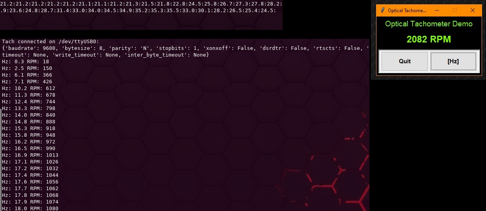

# Optical Tachometer
`optical_tachometer` is a C/C++ source/header pair which can be used in conjunction with
an AVR microcontroller and the
[`optical_tachometer_hardware`](https://github.com/jaylamb/optical_tachometer_hardware)
sensor printed circuit board.

## Usage
The sensor interface to the microcontroller is a single GPIO pin. By default, pin PD2 is
used. This software provides two primary utilities:
- Calculation of rotational speed (in revolutions per minute) detected by the sensor
- Wait for detection of reflective material in proximity to the sensor

### Interrupts
The following microcontroller interrupts are used by this software:
- External interrupt `INT0` is triggered upon the detection of a rising edge on the
pin.
- Timer/Counter0 and its overflow interrupt (`TIMER0_OVF0`) are used to keep track of time
  for frequency calculations.

## Test Programs
This project includes test programs written to use an ATmega328P microcontroller.
The software has been tested on the [Adafruit Metro Mini
328](https://www.adafruit.com/product/2590).

To build and deploy the test software to the microcontroller:

1. Create and navigate to a build directory:

    `cd build && mkdir build/`

2. Point CMake to the AVR toolchain file:

    `cmake -DCMAKE_TOOLCHAIN_FILE=../cmake_avr_functions.cmake ..`

3. Make and deploy the executable:

    `make upload_optical_tachometer`

4a. View the output of the C++ test program by opening a serial terminal on the port
connected to the microcontroller. The UART is configured to use a buad rate of 9600, 8N1
by default.

4b. Run the Python test program from the command line by navigating to the [Python
tests](./test/python_test_program/) and invoking running the `serialtach.py` script:

    `python3 serialtach.py`(Linux) or `py serialtach.py`(Windows)

4c. Run the Python GUI test program from the command line by navigating to the [Python
tests](./test/python_test_program/) and invoking running the `serialtachgui.py` script:

    `python3 serialtachgui.py`(Linux) or `py serialtachgui.py`(Windows)

NOTE: By default, the python script is configured to use port `dev/ttyUSB0`.

## Dependencies
[avr-gcc](https://gcc.gnu.org/wiki/avr-gcc)

[avr-libc](https://www.nongnu.org/avr-libc/)

binutils-avr

### Test Program Dependencies
The Python test program was built in Python version 3.9.5, and requires
[PySerial](https://pypi.org/project/pyserial/) and
[tkinter](https://docs.python.org/3/library/tkinter.html).

## License [Apache 2.0](http://www.apache.org/licenses/)
